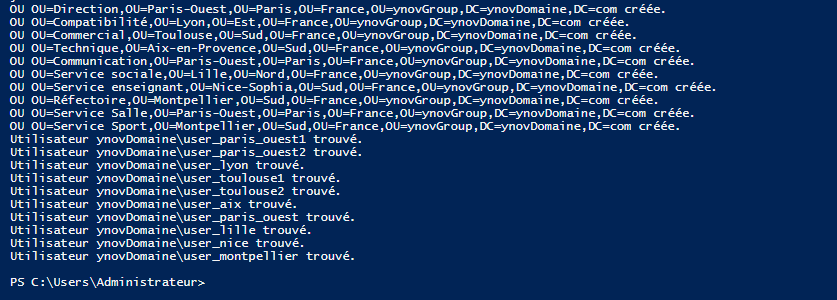
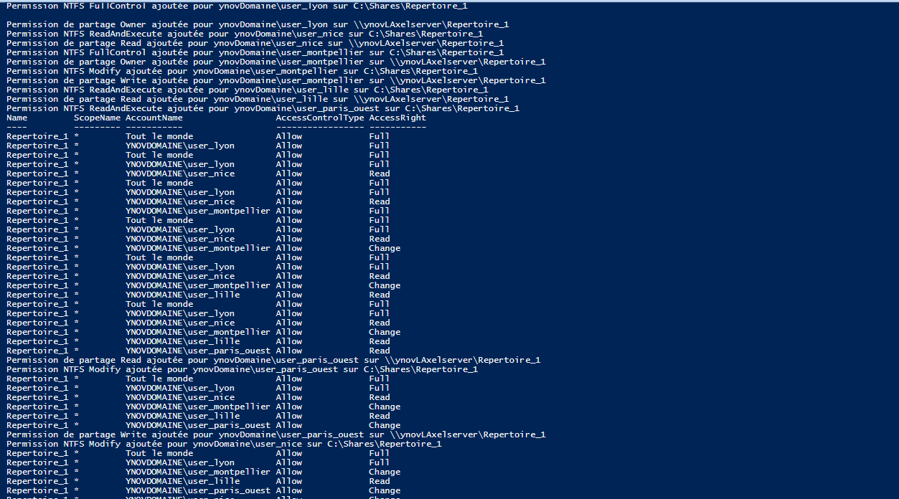
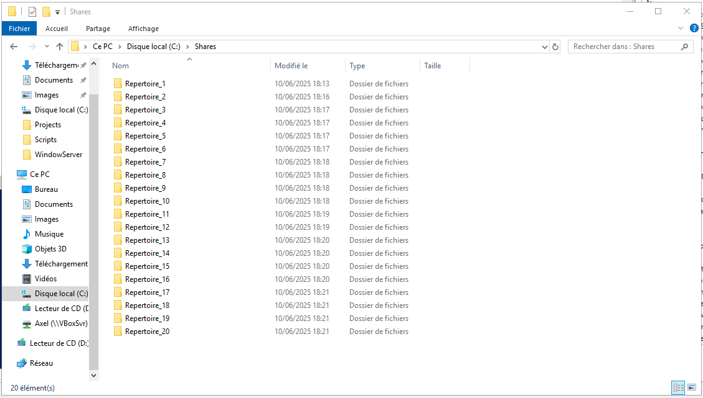
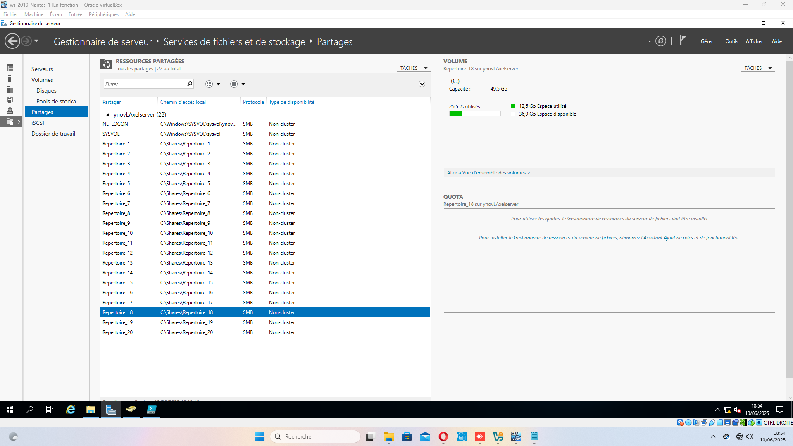

# Configuration et Gestion des Accès

Ce document détaille les étapes de configuration d'Active Directory, incluant la création des Unités d'Organisation (OUs), la création des utilisateurs et la gestion des permissions de partage et NTFS.

## 🔧 Contenu

- [Création des Unités d'Organisation (OUs)](#création-des-unités-dorganisation-ous)
- [Création des Utilisateurs](#création-des-utilisateurs)
- [Mise à Jour des Permissions](#mise-à-jour-des-permissions)

## Création des Unités d'Organisation (OUs)

Le script [`Scripts/create_ou_verif_users.ps1`](./Scripts/create_ou_verif_users.ps1) est utilisé pour créer l'arborescence des Unités d'Organisation (OUs) dans Active Directory. Ces OUs sont structurées par département et localisation, comme par exemple `OU=Direction,OU=Paris-Ouest,OU=Paris,OU=France,OU=ynovGroup,DC=ynovDomaine,DC=com`.

Après l'exécution du script, la console affiche la création ou l'existence des OUs, ainsi que la vérification des utilisateurs. Vous pouvez voir un exemple de cette sortie dans l'image ci-dessous :

## Création des Utilisateurs

Le script [`Scripts/create_users.ps1`](./Scripts/create_users.ps1) se charge de créer les utilisateurs au sein des OUs préalablement définies. Chaque utilisateur est créé avec un nom d'utilisateur (`SamAccountName`), un nom complet (`GivenName`, `Surname`), un `UserPrincipalName`, un mot de passe initial et est activé.

Par exemple, un utilisateur comme `user_paris_ouest1` est créé dans l'OU `OU=Utilisateurs,OU=Paris-Ouest,OU=Paris,OU=France,OU=ynovGroup,DC=ynovDomaine,DC=com`.

## Mise à Jour des Permissions

Le script [`Scripts/update_permissions.ps1`](./Scripts/update_permissions.ps1) est crucial pour la gestion des accès aux répertoires partagés. Il configure à la fois les permissions NTFS et les permissions de partage (SMB) pour chaque utilisateur sur des répertoires spécifiques (`Repertoire_1` à `Repertoire_20`).

Les permissions sont définies par rapport à la fonction et au rôle de chaque utilisateur. Le script gère différents niveaux d'accès : `Read`, `Write`, `Read/Write` (correspondant à `Modify` en NTFS et `Change` en partage), et `Owner` (correspondant à `FullControl`).

Voici ce que la console affiche après l'exécution du script de mise à jour des permissions, montrant les permissions NTFS et de partage appliquées :

Les captures d'écran suivantes montrent l'état des répertoires partagés sur le serveur, illustrant leur présence et les configurations de partage :

Vous pouvez également consulter la sortie complète de la console après l'exécution de ce script dans le fichier [`console.txt`](./console.txt). 